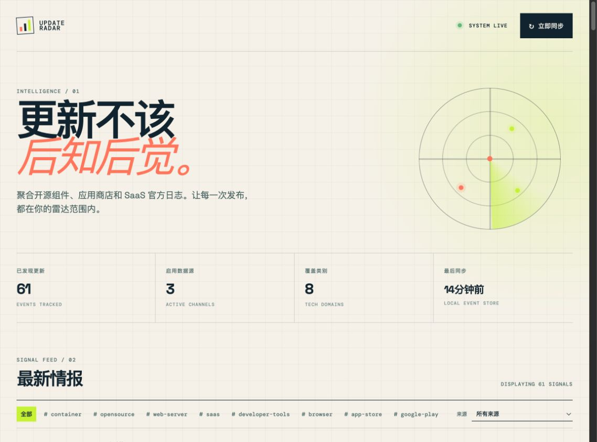

# UpdateRadar

> 全网软件与组件更新监控系统。为开发者、IT 运维与极客玩家打通版本情报的信息差。

UpdateRadar 将 GitHub Releases、应用商店、开源组件和 SaaS 官方更新日志收敛为统一的更新流。用一个本地部署、可扩展的控制台，第一时间追踪重要软件和服务的版本变化。



## 核心能力

- **多渠道采集**：开箱即用支持 GitHub Releases、RSS/Atom、App Store 和 Google Play。
- **统一更新流**：将版本、发布时间、原始链接、摘要和标签规范为同一种事件记录，并自动去重。
- **网页控制台**：查看更新总览、来源状态和最新情报，可按标签或来源快速筛选。
- **前端配置**：直接在“设置”中新增、编辑、启停或删除数据源，不需要手动改配置文件。
- **可靠本地运行**：JSON 原子写入，意外中断不会破坏事件或数据源配置。

## 支持的数据源

- **GitHub Releases**：Docker Engine、NGINX 或任意 GitHub 项目的正式版发布。
- **App Store**：通过 Apple iTunes Lookup API 读取当前版本与发布说明。
- **Google Play**：从公开应用详情页的结构化数据读取版本信息。
- **SaaS 更新日志**：支持 RSS/Atom，例如 GitHub Changelog，也可接入任意官方更新订阅。

## 快速开始

要求：Node.js 22 或更高版本。

```bash
npm start
```

打开 [http://localhost:8787](http://localhost:8787)，进入控制台后点击“立即同步”开始采集。也可以使用 API 手动触发：

```bash
curl -X POST http://localhost:8787/v1/poll
curl 'http://localhost:8787/v1/events?tag=opensource'
```

服务默认监听 `http://localhost:8787`。首次轮询会生成 `data/events.json`，该文件是本地运行数据，不纳入 Git。

在浏览器中打开 `http://localhost:8787` 即可使用监控控制台。首页包含数据源概览、标签/来源筛选、最新更新时间线和手动同步按钮。通过顶部“设置”或“管理数据源”可以在网页中新增、编辑、启停或删除数据源，配置会安全写入 `data/sources.json`。

## Docker Compose 部署

监控配置和事件数据都保存在 `data/` 目录：

- `data/sources.json`：数据源配置。通过控制台新增、编辑、启停或删除数据源时会更新此文件。
- `data/events.json`：已采集的更新事件。首次同步时自动创建；默认不纳入 Git。

项目使用“写入临时文件后重命名”的方式保存这两个 JSON 文件，避免进程中断留下半写入的数据。使用 Docker Compose 时，`./data` 会挂载至容器中的 `/app/data`，因此重建或更新容器不会丢失监控配置和事件记录。

```bash
docker compose up --build -d
```

服务地址为 `http://localhost:8787`。查看运行状态可执行：

```bash
docker compose ps
docker compose logs -f update-radar
```

停止服务但保留数据：

```bash
docker compose down
```

监控卡片中的 GitHub、RSS、App Store 与 Google Play 图标通过 [Simple Icons CDN](https://cdn.simpleicons.org/) 引用；其中 App Store 图标为 `https://cdn.simpleicons.org/appstore/10232e`。

## API

| Method | Path | Purpose |
| --- | --- | --- |
| `GET` | `/health` | 存活探针 |
| `GET` | `/v1/sources` | 返回已配置的数据源 |
| `POST` | `/v1/sources` | 创建数据源 |
| `PUT` | `/v1/sources/:id` | 更新数据源配置 |
| `DELETE` | `/v1/sources/:id` | 删除数据源 |
| `POST` | `/v1/poll` | 立即采集全部启用的数据源 |
| `GET` | `/v1/events?sourceId=&tag=&limit=` | 查询更新事件，最大 200 条 |

## 添加监控目标

编辑 [data/sources.json](data/sources.json)。每项都需要稳定的 `id`、可读的 `name`、`kind` 与 `tags`。可用的 `kind`：

```json
{
  "id": "nodejs",
  "name": "Node.js",
  "kind": "github-releases",
  "enabled": true,
  "owner": "nodejs",
  "repo": "node",
  "includePrereleases": false,
  "tags": ["runtime", "opensource"]
}
```

`rss` 使用 `feedUrl`；`app-store` 使用 `appId` 和可选的 `country`；`google-play` 使用 `packageId`、可选的 `language`/`country`。App Store 与 Google Play 示例默认关闭，避免未配置时无意义地抓取。

## 架构与下一步

采集适配器位于 [src/adapters](src/adapters)，只输出标准化更新对象。`src/radar.js` 负责采集和去重，`src/store.js` 为存储边界，HTTP API 位于 `src/server.js`。这个分层让后续迁移 PostgreSQL、增加定时任务、Webhook、邮件/飞书通知、用户订阅和 Web 控制台时不需要重写渠道适配器。

Google Play 页面格式可能变化，适配器会在无法获取公开结构化版本信息时安全返回空结果。需要强 SLA 的生产系统应使用获授权的数据供应商或应用方 API，并为每个来源记录轮询失败和速率限制状态。
